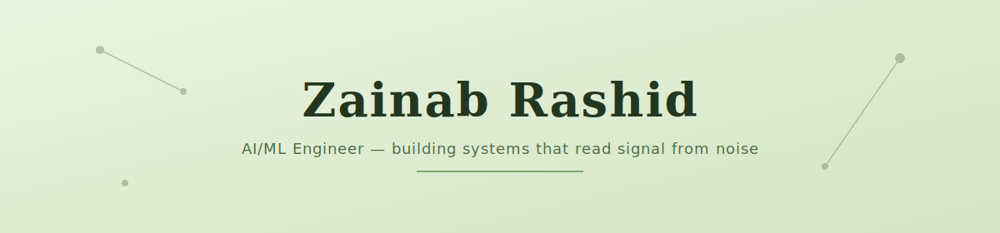
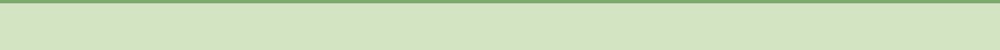

 

I build systems that turn scattered, real-world data into decisions worth acting on. My final year project, **ResQMap**, took chaotic disaster reports and used a fine-tuned language model to surface the most critical incidents first. Before that, I was training retrieval pipelines to make medical information easier to trust, and interning at Nexium building AI-first web products.

I graduated from FAST-NUCES with a Silver Medal, and I care more about whether something actually works under pressure than whether it looks good in a demo.

 

 

### Where I've built things

<table width="100%">
<tr>
<td width="50%" valign="top">

**ResQMap** — *AI-powered disaster response*
Crowdsourced incident reporting, verified in real time, ranked by a DistilBERT model fine-tuned on CrisisMMD so the worst-hit areas surface first.
`React Native` · `Node.js` · `PyTorch` · `Firebase`
[→ repo](https://github.com/Zainab322/ResQMap)

</td>
<td width="50%" valign="top">

**Medical RAG System** — *grounded AI answers*
Retrieval-augmented generation over medical sources using LangChain and FAISS, built to reduce hallucination in a domain where being wrong has real cost.
`LangChain` · `FAISS` · `Gemini Flash` · `Python`

</td>
</tr>
</table>

 

### Stack

 

 

Currently exploring roles in AI/ML and software engineering.

